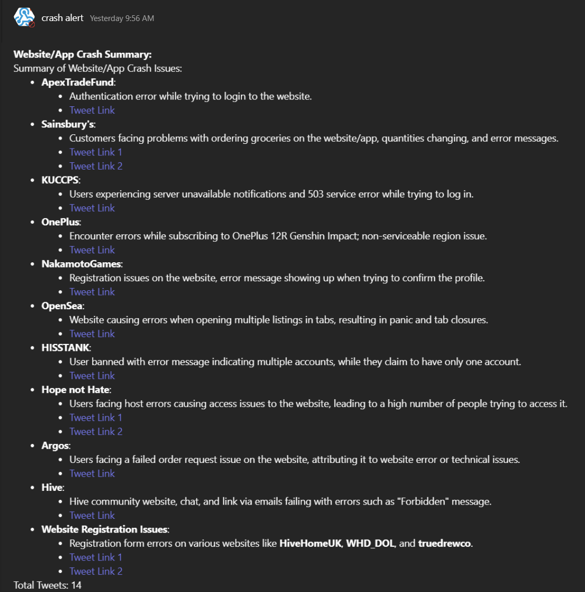

# Website/App Crash Reporter

## Description
The Website/App Crash Reporter is a collection of Python scripts designed to streamline the process of extracting, classifying, and summarizing tweets related to website and app crashes. By leveraging OpenAI's natural language processing capabilities and integrating with Microsoft Teams, this toolkit provides a comprehensive solution for monitoring and analyzing user-reported issues on social media platforms, resulting in saving 100 hours of manual work every month.

## Introduction
The Website/App Crash Reporter aims to revolutionize the way operation teams handle user-reported issues on social media platforms. By automating the extraction, classification, and summarization of relevant tweets, this toolkit eliminates the need for manual monitoring and analysis, saving 100 hours of manual work every month. 

## Built With

- 
- 
- 
- 
- 

## Contents
- **tweets_scraping.py**: Python script for scraping tweets from JSON files and extracting them into a CSV file.
- **tweets_classification.py**: Python script for predicting website/app crashes based on tweet content.
- **tweets_issues_summary.py**: Python script for generating a summary of tweets indicating website/app crashes.
- **send_to_teams.py**: Python script for sending tweet summaries to Microsoft Teams.
- **performance_evaluation.py**: Python script for evaluating the performance of the tweet summarization process.

## Features
- **Tweet Scraping**:
  - Extract tweets from JSON files and save them into a CSV file.
- **Classification**:
  - Predict whether a tweet indicates a website/app crash.
- **Summary Generation**:
  - Generates a summary of tweets indicating crashes by category.
- **Integration with Microsoft Teams**:
  - Sends tweet summaries to Microsoft Teams for collaborative communication.
- **Performance Evaluation**:
  - Evaluates the model performance of the tweet classification process.

## Example Data
To help users understand how the scripts work, we provide example input data in the form of JSON files containing tweets. Additionally, we include the expected output, which is a CSV file containing the extracted tweets from the input JSON files.

- **Input Data**:
  - `tweets1.json`: Sample JSON file containing tweets.
  - `tweets2.json`: Sample JSON file containing tweets.
  - `tweets3.json`: Sample JSON file containing tweets.
  - `tweets4.json`: Sample JSON file containing tweets.
  - `tweets5.json`: Sample JSON file containing tweets.
- **Expected Output**:
  - `extracted_tweets.csv`: CSV file containing the extracted tweets from the input JSON files.

- **Example tweets (maybe/maybe not) reporting issues**:
  - "Maybe it's time to hire new web developers. The Morocco-Portugal website won't let you log in. Always the same error 'mandatory field cannot be left blank' although I fill that field."
  - "@SBICard_Connect The fix from your team only lasted for 1 day and now again I am facing the same issue and cannot login to my account. Tried the app as well as the website but getting the same error."
  - "A man who sued #Powerball and the #DCLottery for their website #error that showed he had the #winning numbers, making him believe he would receive $340 million last year, will head for a #court hearing this week. #dc #lawsuit #powerballlawsuit #court [Link to Article]"

## Challenges and Learnings
- Collection of dataset due to lack of access to Twitter API at the moment (due to financial reasons), so scraped tweets from JSON files acquired from the web.

## Future Plans
- Cover other languages, which has been proven to be working.
- Expand to "predicting" website crashes based on tweets about big events/releases.
- Fine-tune classification models.
